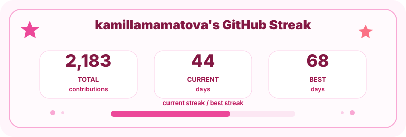
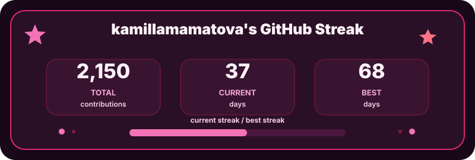

# GitHub Streak Stats

This repo generates a local SVG stats card for a GitHub profile README.

The one I previously had that I found online kept on glitching and whatever, and it's kind of annoying so I'm gonna try to make my own.





## Use In Your Profile README

Add this to your profile README:

```md

```

Dark mode version:

```md

```

If your remote repository uses `main` instead of `master`, replace `master` in the URL with `main`.

## Private Contributions

To include private contributions:

1. On GitHub, open your profile.
2. Above the contribution calendar, open `Contribution settings`.
3. Turn on `Private contributions`.
4. In this repository, add an Actions secret named `STATS_TOKEN`.

The secret should be a GitHub token for your account. The default `GITHUB_TOKEN` can update the SVG, but it usually cannot see your private contribution history as you.

## Run Locally

```sh
STATS_TOKEN=your_github_token npm run generate
```
